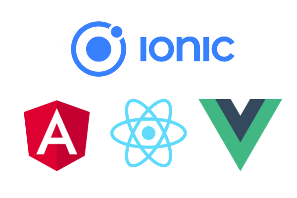

# Awesome Ionic []

> A curated list of awesome Ionic libraries, resources, and solutions from Ionic 1 to the latest version of the framework.

This repository is maintained by [Fikayo Adepoju](https://github.com/coderonfleek) and [Alessio Delmonti](https://github.com/Alexintosh). For discussions about PRs and contributions, contact Fikayo via DM on [twitter](https://twitter.com/coderonfleek).

# Resources by Version

- [General](#general)
- [Ionic 1 (Angularjs)](IONIC1.md)
- [Ionic Angular (2+)](ionic-angular.md)
- [Ionic React](ionic-react.md)
- [Ionic Vue]()
- [Capacitor](#capacitor)
- [Built with Ionic](#built-with-ionic)
- [Stencil](https://github.com/Alexintosh/awesome-stencil)

# General

- [Official Website](https://ionicframework.com/)
- [Blog](https://blog.ionicframework.com/)
- [Documentation](https://ionicframework.com/docs/)
- [Github Repository](https://github.com/ionic-team/ionic-framework)
- [Community Forum](http://forum.ionicframework.com/)
- [Capacitor](https://capacitorjs.com/)
- [Ionic Native](https://github.com/driftyco/ionic-native/)
- [Appflow](https://ionicframework.com/appflow)
- [Ionic Enterprise](https://ionicframework.com/enterprise)
- [Ionic Global Community](https://ionicframework.com/community)
- [Ionic Youtube Channel](https://www.youtube.com/channel/UChYheBnVeCfhCmqZfCUdJQw)
- [Ionic on CodePen](http://codepen.io/ionic/)
- [Ionic IRC](http://webchat.freenode.net/?randomnick=1&channels=%23ionic&uio=d4)
- [Ionic Starter Apps](https://ionicthemes.com)
- [Ionic Free Tutorials](https://ionicthemes.com/tutorials)

# Capacitor

- [Official Website](https://capacitorjs.com/)
- [Documentation](https://capacitorjs.com/docs)
- [Capacitor Plugins](https://capacitorjs.com/docs/plugins)
- [Blog](https://capacitorjs.com/blog)
- [Forum](https://forum.ionicframework.com/c/capacitor)
- [Github Project](https://github.com/ionic-team/capacitor)
- [Twitter](https://twitter.com/capacitorjs)

# Built With Ionic

- [WhatsApp Clone](https://github.com/coderonfleek/whatsapp-clone)
