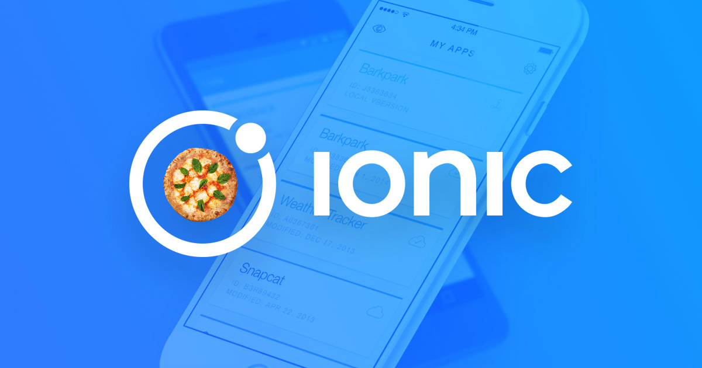

# Awesome Ionic []

> A curated list of awesome Ionic libraries, resources and solutions.

Are you looking for ionic 1 resouces? [Click here](https://github.com/Alexintosh/Awesome-Ionic/blob/master/IONIC1.md)

General
======
* [Official Website](http://ionicframework.com)
* [Blog](http://blog.ionic.io/)
* [Documentation](http://ionicframework.com/docs/v2/)
* [Ionic Native](https://github.com/driftyco/ionic-native/)
* [Github Repository](https://github.com/driftyco/ionic)
* [Showcase](http://showcase.ionicframework.com/)
* [Learn Ionic](http://learn.ionicframework.com/)
* [Ionic on CodePen](http://codepen.io/ionic/)
* [Community Forum](http://forum.ionicframework.com/)
* [Ionic IRC](http://webchat.freenode.net/?randomnick=1&channels=%23ionic&uio=d4)
* [Ionic Youtube Channel](https://www.youtube.com/channel/UChYheBnVeCfhCmqZfCUdJQw)

Complete projects
======

### Awesome Demos
* [Ionic Lottie Sample](https://github.com/yannbf/ionic-lottie) 

### Boilerplate/Demo Apps
* [Ionic Boilerplate](https://github.com/marcoturi/ionic-boilerplate) 
* [Redux](https://github.com/janjarfalk/ionic2-angular2-ts-redux-boilerplate) 
* [Cordova File Transfer](https://github.com/dsgriffin/ionic-2-file-transfer-example) 
* [Update your App](https://github.com/NextFaze/ionic-manup) 
* [NFC Demo](https://github.com/RedFroggy/ionic2-nfc-app) 
* [Fullscreen Content](https://github.com/sebaferreras/Ionic2-FullscreenContent) 
* [Card Layout](https://github.com/joshuamorony/ionic2-card-layout) 
* [Ionic 2](https://github.com/marcoturi/ionic2-boilerplate) 
* [Ionic 2 Advanced Components](https://github.com/yannbf/ionic2-components) 
* [ORC Scan App](https://github.com/matiastucci/ionic-ocr-example) 

### Open source apps
* [Realty](https://github.com/ccoenraets/ionic2-realty) 
* [mHUD - Car App](https://github.com/paulcockrell/mHUD)  Speed tracking
* [Restaurant App](https://github.com/srehanuddin/Ionic2-ResturantApp) 
* [Conference App](https://github.com/driftyco/ionic-conference-app) 
* [Conference App based on Lanyrd API](https://github.com/ionic2blueprints/conference-app) 
* [Wordpress Client](https://github.com/ionic2blueprints/ionic2-wp-client) 
* [Media Player](https://github.com/ionic2blueprints/media-player) 
* [Social App](https://github.com/ionic2blueprints/social-app) 
* [Push Notification](https://github.com/aggarwalankush/ionic2-push-base) 
* [Weather app](https://github.com/aggarwalankush/ionic2-mosum) 
* [Reddit Reader](https://github.com/smartapant/ionic2-reddit-reader) 
* [YouTube](https://github.com/hughred22/Ionic2-Angular2-YouTube-Channel-App) 
* [Freshlypressed API App](https://github.com/rajayogan/ionic2-freshlypressed) 
* [Geo Fence](https://github.com/tsubik/ionic2-geofence) 
* [Image Gallery](https://github.com/driftyco/ionic-image-gallery-app) 
* [Real-World App](https://github.com/seeschweiler/iongithub) 
* [Bwitter - Twitter](https://github.com/obetomuniz/ionic2-bwitter) 
* [Inoffical "Myki" App](https://github.com/longzheng/mypal-ionic) 
* [Timer App](https://github.com/imjohnbo/ionic2-timer) 

Tutorials
======

#### Video Tutorials
* [Ionic 2 Quickstart](https://www.udemy.com/ionic-2-quickstart/) 
* [Build a Todo App from Scratch with Ionic 2](http://www.joshmorony.com/build-a-todo-app-from-scratch-with-ionic-2-video-tutorial/) 
* [Ionic 2: How to Use Google Maps & Geolocation](http://www.joshmorony.com/ionic-2-how-to-use-google-maps-geolocation-video-tutorial/) 
* [Ionic 2 in One Hour](http://courses.devdactic.com/courses/ionic-2-in-one-hour?product_id=104238) 
* [Build a Custom Flash Card Component in Ionic 2](https://www.youtube.com/watch?v=BKFQKywl_GM) 
* [Hacking CSS in Ionic 2](https://www.youtube.com/watch?v=sXFmkdhOEVc) 

### Basics
* [Beginners Guide to Getting Started with Ionic 2](http://www.joshmorony.com/beginners-guide-to-getting-started-with-ionic-2/) 
* [Ionic 2 First Look Series: Your First Ionic 2 App Explained](http://www.joshmorony.com/ionic-2-first-look-series-your-first-ionic-2-app-explained/) 
* [How to Convert an Ionic 1 Application to Ionic 2](http://www.joshmorony.com/how-to-convert-an-ionic-1-application-to-ionic-2/) 
* [A Simple Guide to Navigation in Ionic 2](http://www.joshmorony.com/a-simple-guide-to-navigation-in-ionic-2/) 
* [10 Minutes with Ionic 2: Adding Pages and Navigation](http://blog.ionic.io/10-minutes-with-ionic-2-adding-pages-and-navigation/) 
* [10 Minutes with Ionic 2: Calling an API](http://blog.ionic.io/10-minutes-with-ionic-2-calling-an-api/) 
* [How To Update Your Application Project and CLI](http://www.gajotres.net/ionic-2-how-to-update-your-application-project-and-cli/) 
* [How to Create a Data Model in Ionic 2](http://www.joshmorony.com/how-to-create-a-data-model-in-ionic-2/) 
* [Ionic 2 and External Libraries](http://mhartington.io/post/ionic2-external-libraries/) 
* [Understanding Zones and Change Detection](http://www.joshmorony.com/understanding-zones-and-change-detection-in-ionic-2-angular-2/) 
* [Understanding Ionic 2: Pipe](http://mcgivery.com/understanding-ionic-2-pipe/) 
* [How to Manipulate Data in Ionic 2: Part 1](http://www.joshmorony.com/how-to-manipulate-data-in-ionic-2-part-1/) 
* [How to Manipulate Data in Ionic 2: Part 2](http://www.joshmorony.com/how-to-manipulate-data-in-ionic-2-part-2/) 
* [Filtering, Mapping, and Reducing Arrays in Ionic 2](https://www.youtube.com/watch?v=A-4CLa05tp0) 

#### Theming
* [A Guide to Styling an Ionic 2 Application](http://www.joshmorony.com/a-guide-to-styling-an-ionic-2-application/) 
* [Best practice when adding FontAwesome to an ionic2 app](http://luiscabrera.site/tech/2017/01/09/fontawesome-in-ionic2.html) 
* [A List of Common CSS Utility Attributes in Ionic 2](http://www.joshmorony.com/a-list-of-common-css-utility-attributes-in-ionic-2/) 

#### Components
* [How to Create a Sliding Delete Button for Lists](http://www.joshmorony.com/ionic-2-how-to-create-a-sliding-delete-button-for-lists/) 
* [Creating a Sliding Introduction Component in Ionic 2](http://www.joshmorony.com/creating-a-sliding-introduction-component-in-ionic-2/) 
* [How to Create a Custom Loading Component in Ionic 2](http://www.joshmorony.com/how-to-create-a-custom-loading-component-in-ionic-2/) 
* [Build a Simple Progress Bar Component in Ionic 2](http://www.joshmorony.com/build-a-simple-progress-bar-component-in-ionic-2/) 
* [Create a News Feed with 360-Degree Photo Viewing in Ionic 2](http://www.joshmorony.com/create-a-news-feed-with-360-degree-photo-viewing-in-ionic-2/) 
* [Build a Tap to Reveal Component in Ionic 2](https://www.joshmorony.com/build-a-tap-to-reveal-component-in-ionic-2/) 

#### Authentication
* [Add Touch ID Authentication To An Ionic 2 Mobile App](https://www.thepolyglotdeveloper.com/2016/03/add-touch-id-authentication-ionic-2-mobile-app/) 
* [Successful OAuth Social Login with Firebase](http://www.gajotres.net/ionic-2-succesfull-oauth-social-login-with-firebase/) 
* [Using An Oauth 2.0 Service Within An Ionic 2 Mobile App](https://www.thepolyglotdeveloper.com/2016/01/using-an-oauth-2-0-service-within-an-ionic-2-mobile-app/) 
* [Ionic 2 and Auth0](http://blog.ionic.io/ionic-2-and-auth0/) 
* [Handling a Simple User Authorization](http://www.gajotres.net/ionic-2-handling-a-simple-user-authorization/) 
* [Authenticate Ionic 2 with WordPress](https://auth0.com/authenticate/ionic2/wordpress) 

#### Unit Testing
* [Ionic 2 Unit Testing](http://lathonez.github.io/2017/ionic-2-unit-testing/) 
* [How to Unit Test an Ionic 2 Application](http://www.joshmorony.com/how-to-unit-test-an-ionic-2-application/) 
* [Test Driven Development in Ionic 2: An Introduction to TDD](https://www.joshmorony.com/test-driven-development-in-ionic-2-an-introduction-to-tdd/) 

#### Ionic Native / Cordova Plugins
* [Using Cordova Plugins in Ionic 2 with Ionic Native](http://www.joshmorony.com/using-cordova-plugins-in-ionic-2-with-ionic-native/) 
* [How to Work With Cordova Plugins](http://www.gajotres.net/ionic-2-how-to-use-cordova-plugins/) 
* [10 Minutes with Ionic 2: Using the Camera with Ionic Native](http://blog.ionic.io/10-minutes-with-ionic-2-using-the-camera-with-ionic-native/) 
* [How to Use Google Maps & Geolocation ](http://www.joshmorony.com/ionic-2-how-to-use-google-maps-geolocation-video-tutorial/) 
* [Determine Network Availability](https://www.thepolyglotdeveloper.com/2016/01/determine-network-availability-in-an-ionic-2-mobile-app/) 
* [Monetize With Google Admob In An Ionic 2 Mobile App](https://www.thepolyglotdeveloper.com/2016/02/monetize-google-admob-ionic-2-mobile-app/) 
* [Show Native Toast Notifications In An Ionic 2 Mobile App](https://www.thepolyglotdeveloper.com/2016/01/show-native-toast-notifications-in-an-ionic-2-mobile-app/) 
* [Having Fun With Cordova Geolocation Plugin](http://www.gajotres.net/ionic-2-having-fun-with-cordova-geolocation-plugin/) 
* [Use SQLite In Ionic 2 Instead Of Local Storage](https://www.thepolyglotdeveloper.com/2015/12/use-sqlite-in-ionic-2-instead-of-local-storage/) 
* [Launch Websites With Ionic 2 Using The InAppBrowser](https://www.thepolyglotdeveloper.com/2016/01/launch-websites-with-ionic-2-using-the-inappbrowser/) 
* [Add Barcode Scanning Functionality To Your Ionic 2 App](https://www.thepolyglotdeveloper.com/2016/02/add-barcode-scanning-functionality-to-your-ionic-2-app/) 
* [Use Google Analytics In An Ionic 2 Android And iOS App](https://www.thepolyglotdeveloper.com/2016/03/use-google-analytics-in-an-ionic-2-android-and-ios-app/) 
* [Share Things On Social Media Via An Ionic 2 Mobile App](https://www.thepolyglotdeveloper.com/2016/02/share-things-on-social-media-via-an-ionic-2-mobile-app/) 
* [How To Use PouchDB + SQLite For Local Storage In Ionic 2](http://gonehybrid.com/how-to-use-pouchdb-sqlite-for-local-storage-in-ionic-2/) 
* [Adding Background Geolocation to an Ionic 2 Application](http://www.joshmorony.com/adding-background-geolocation-to-an-ionic-2-application/) 
* [Getting Familiar with Local Notifications in Ionic 2](http://www.joshmorony.com/getting-familiar-with-local-notifications-in-ionic-2/) 
* [Create a Nearby Places List with Google Maps in Ionic 2 – Part 1](http://www.joshmorony.com/create-a-nearby-places-list-with-google-maps-in-ionic-2-part-1/)   
* [Create a Nearby Places List with Google Maps in Ionic 2 – Part 2](http://www.joshmorony.com/create-a-nearby-places-list-with-google-maps-in-ionic-2-part-2/) 

#### Backend as a Service
* [10 Minutes with Ionic 2: Calling an API](http://blog.ionic.io/10-minutes-with-ionic-2-calling-an-api/) 
* [Using Http to Fetch Remote Data from a Server in Ionic 2](http://www.joshmorony.com/using-http-to-fetch-remote-data-from-a-server-in-ionic-2/) 
* [Making REST HTTP Requests Like a Pro](http://www.gajotres.net/ionic-2-making-rest-http-requests-like-a-pro/) 
* [Posting data from Ionic 2 app to a PHP server](http://www.nikola-breznjak.com/blog/ionic2/posting-data-from-ionic-2-app/) 
* [Make HTTP Requests In An Ionic 2 Android And iOS App](https://www.thepolyglotdeveloper.com/2016/01/make-http-requests-in-an-ionic-2-android-and-ios-app/) 
* [Integrating Firebase with AngularFire2 into AngularJS & Ionic2](http://www.clearlyinnovative.com/integrating-firebase-with-angularfire2-into-angularjs-ionic2) 

#### i18n & l10n
* [Internationalize and Localize Your App With Angular 2](http://www.gajotres.net/ionic-2-internationalize-and-localize-your-app-with-angular-2/) 

Tools
======
* [Ionic2-vscode](https://marketplace.visualstudio.com/items?itemName=jgw9617.ionic2-vscode) 
* [Vim-ionic2](https://github.com/akz92/vim-ionic2) 

Components
======
Merged from [here](https://github.com/fishme/awesome-ionic2-components).

### Animations
* [Lottie Animation](https://github.com/chenqingspring/ng-lottie) 

### Menu, Tabs
* [Scrollabel Tabs](https://github.com/SinoThomas/Ionic2-ScrollableTabs)  
* [Circular Tabs](https://github.com/SinoThomas/Ionic2-CircularTabs) 
* [Fab Toolbar](https://github.com/ekhmoi/fab-toolbar) 
* [Multi Level Sidemenu](https://github.com/sebaferreras/Ionic2-MultiLevelSideMenu) 
* [Popover Sidemenu](https://github.com/philipbrack/ionic2-menu-alternative-popover) 

### Form / Input
* [Autocomplete](https://github.com/kadoshms/ionic2-autocomplete) 
* [Form Generator based on JSON](https://github.com/makinacorpus/angular2-schema-form)  
* [Dynamic Forms](https://github.com/udos86/ng2-dynamic-forms/)  
* [Form Builder](https://github.com/rohitg7/ionic2-form-builder) 
* [Sidemenu tabs](https://github.com/seanmavley/ionic2-sidemenu-tabs) 

#### Input - Date/Calendar
* **Calendar**
   * [Calendar](https://github.com/twinssbc/Ionic2-Calendar)  
   * [Calendar](https://github.com/alexandretok/easy-ionic2-calendar) 
   * [Calendar](https://github.com/redpandatronicsuk/ionic2calendar) 
   * [Calendar](https://github.com/mattlewis92/angular-calendar)  (very powerful) 
   * [Calendar - Fullcalendar](https://github.com/nekken/ng2-fullcalendar) 
* **Datepicker**
   * [Datepicker](https://github.com/misha130/datepicker-ionic2)  
   * [Datepicker (selectable range dates calendar)](https://github.com/HsuanXyz/ion2-calendar) 
   * [Datepicker](https://github.com/rajeshwarpatlolla/ionic2-datepicker) 
* [Rating](https://github.com/andrucz/ionic2-rating)  
* [Inputfield Mask](https://github.com/text-mask/text-mask)

### Lists/Table

* [Sortable/Filter Tables](https://github.com/valor-software/ng2-table)  
* [Smart table (sorting, filtering ...)](https://github.com/akveo/ng2-smart-table) 
* [Flexible and Light Table](https://github.com/swimlane/ngx-datatable) 

### Images
* [Signatur](https://github.com/wulfsolter/angular2-signaturepad)  works perfect with  
* [Image Fallback](https://github.com/VadimDez/ng2-img-fallback) 
* [Lazy Load](https://github.com/tjoskar/ng2-lazyload-image)  
* [Image Loader](https://github.com/zyramedia/ionic-image-loader) 
* [Facebook Gallery](https://github.com/skyfloyd/ionic2-fb-gallery) 
* [Image Viewer](https://github.com/Riron/ionic-img-viewer) 
* [Gallery Modal](https://github.com/nikini/ionic-gallery-modal) 
* [Image Zoom](https://github.com/brtnshrdr/angular2-image-zoom) 

### Charts/Diagram
* [Charts](https://github.com/valor-software/ng2-charts) 
* **D3 Approaches**
  * [D3 Service](https://github.com/tomwanzek/d3-ng2-service) 
  * [D3 Barchart](https://github.com/keathmilligan/angular2-d3-v4) 
  * [D3 Line/Bar/Pie Charts](https://github.com/datencia/d3js-angular2-example) 

### Video/Audio
* [Video Editor](https://github.com/rossmartin/video-editor-ionic2) 
* [Audio Recorder](https://github.com/tracktunes/ionic-recorder) 
* [Simple Audioplayer](https://github.com/arielfaur/ionic-audio) 

### Keyboards
* [Digit Keyboard](https://github.com/skol-pro/ion-digit-keyboard-v2) 

### Dialog
* [Dialogbox with Counter](https://github.com/HsuanXyz/ionic2-extend-alert) 

### Frames
* [ng Lightning (for Salesforce Apps)](https://github.com/ng-lightning/ng-lightning) 

Are you Italian?
======

**Join** the italian [Ionic Framework community](https://www.facebook.com/groups/380772785422827/)!

